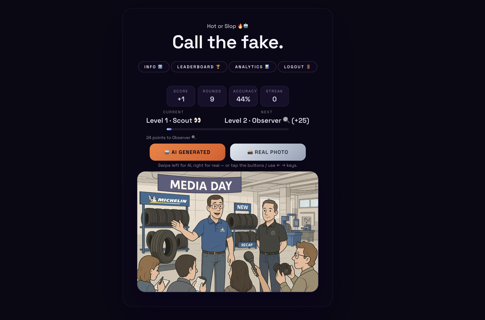

# Hot or Slop

Hot or Slop is a single-page React + TypeScript experience that challenges players to spot AI-generated imagery among real-world captures. Cards stream in real time from the [ComplexDataLab/OpenFake](https://huggingface.co/datasets/ComplexDataLab/OpenFake) dataset; each guess updates your score, level, and local leaderboard position instantly.

<p align="center">
  
</p>

## Table of Contents

1. [Gameplay Overview](#gameplay-overview)
2. [Progression & Levels](#progression--levels)
3. [Leaderboard & Percentiles](#leaderboard--percentiles)
4. [Tech Stack](#tech-stack)
5. [Architecture](#architecture)
6. [Development Workflow](#development-workflow)
7. [Project Structure](#project-structure)
8. [Dataset & Licensing](#dataset--licensing)
9. [Future Improvements](#future-improvements)
10. [Contributing](#contributing)

---

## Gameplay Overview

- **Swipe or tap** – Mark each card `AI Generated` or `Real Photo` (keyboard shortcuts ← / → also work).
- **Immediate feedback** – A Hot/Slop chip confirms your guess and, for synthetic cards, exposes the generator model.
- **Balanced decks** – Every deck is automatically split 50/50 between real and fake images and prefetched so rapid swiping stays smooth.
- **Heads-up stats** – Score, rounds played, accuracy, streak, and level progression are always visible above the card.
- **Info panel** – Summaries of the current image, dataset details, and the full level list live in the `Info` modal.

## Progression & Levels

Levels are tied to cumulative score (clamped at a minimum of 0) and stored locally. The HUD shows your current level, next target, progress bar, and points remaining.

| Level | Name     | Score Range | Next Unlock |
| ----- | -------- | ----------- | ----------- |
| 1     | Scout    | 0 – 24      | Unlocks Observer at 25 |
| 2     | Observer | 25 – 59     | Unlocks Sleuth at 60   |
| 3     | Sleuth   | 60 – 119    | Unlocks Examiner at 120 |
| 4     | Examiner | 120 – 199   | Unlocks Analyst at 200 |
| 5     | Analyst  | 200 – 319   | Unlocks Oracle at 320 |
| 6     | Oracle   | 320+        | Top tier |

## Leaderboard & Percentiles

- **Local storage only** – Scores, rounds, and updated timestamps are kept in `localStorage` per device.
- **Percentile curve** – The leaderboard modal plots your score relative to stored runs (including the current session) and shows a ranked table with rounds and score.
- **Rounding rules** – Only the best score per player handle is persisted, and values never drop below 0.

## Tech Stack

- [Vite](https://vitejs.dev/) + [React 19](https://react.dev/) + [TypeScript](https://www.typescriptlang.org/)
- CSS-only styling (no runtime CSS-in-JS) with custom gradients/glassmorphism
- [Hugging Face Datasets Server](https://huggingface.co/docs/datasets-server) REST calls for OpenFake imagery
- Local storage for onboarding state, player handle, and leaderboard

## Architecture

- `App.tsx` drives the main state machine: deck management, swipe handling, keyboard shortcuts, score/level updates, and modal toggles.
- `services/openfake.ts`
  - Fetches rows from OpenFake `test` split
  - Filters by allowed model prefixes (`real`, `imagen`, `gpt`, `flux`)
  - Prefetches decks ahead of time and enforces real/fake balance
- UI is broken into minimal sections inside the main component to avoid additional global state managers. Hook usage includes `useCallback`/`useMemo` for derived state and memoized handlers.

## Development Workflow

Install dependencies and run the dev server:

```bash
npm install
npm run dev
```

Additional scripts:

```bash
npm run build   # Type-check then build production bundle
npm run preview # Serve production bundle locally
npm run lint    # ESLint using the Vite/React TypeScript config
```

## Project Structure

```
src/
  App.tsx        # Main component, state orchestration, UI sections
  App.css        # Component-specific styling and layout
  index.css      # Global fonts, background, resets
  main.tsx       # Application bootstrap
  services/
    openfake.ts  # Hugging Face dataset client & deck balancing
public/
  images/        # Local assets used during onboarding/demo
```

## Dataset & Licensing

- **Dataset**: [ComplexDataLab/OpenFake](https://huggingface.co/datasets/ComplexDataLab/OpenFake)
- **License**: CC BY-SA 4.0

The Info modal reiterates the license and links to the dataset. Imagery is used strictly for demonstration/testing and not redistributed.

## Future Improvements

- Global leaderboards (Supabase or serverless endpoint)
- Practice round during onboarding to acclimate first-time players
- Accessibility mode with higher contrast and larger hit targets
- Weekly season resets with history snapshots
- Additional generator filters and quick-difficulty switches
- Telemetry (time-to-guess, per-model accuracy) surfaced in the Info panel

## Contributing

Issues and pull requests are welcome—especially around balancing, UX tweaks, new dataset filters, or accessibility fixes. If you add generators, update `ALLOWED_MODEL_PREFIXES` in `services/openfake.ts` and be sure to respect the dataset licensing.

---

Have fun calling the fake 👁️‍🗨️
